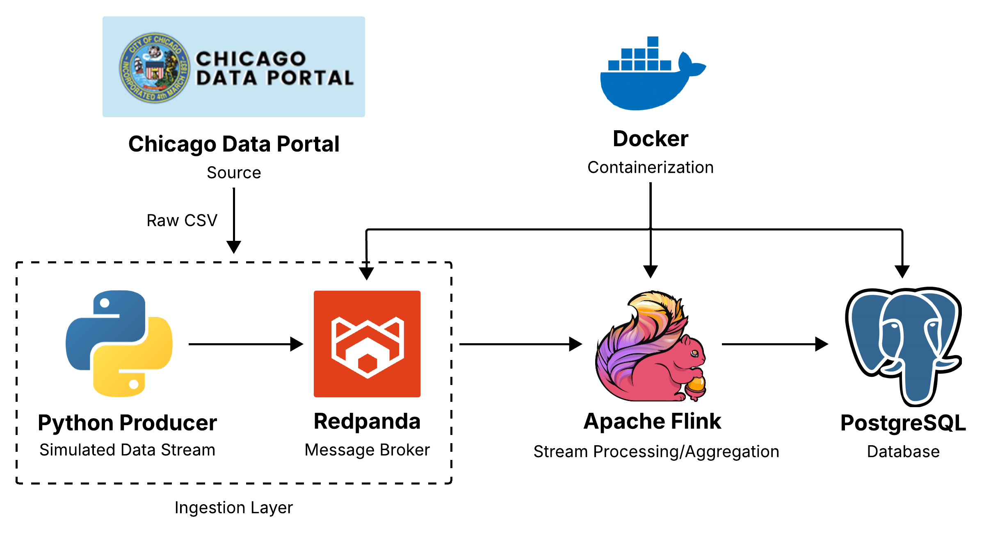

# Chicago Crimes Streaming Pipeline
## Introduction
A Dockerized real-time streaming pipeline built with Redpanda (Kafka-compatible), Apache Flink, and PostgreSQL.
The pipeline simulates live data ingestion from the Chicago Data Portal, processes streaming events using Apache Flink, and stores aggregated results in PostgreSQL.

## Infrastructure Overview
